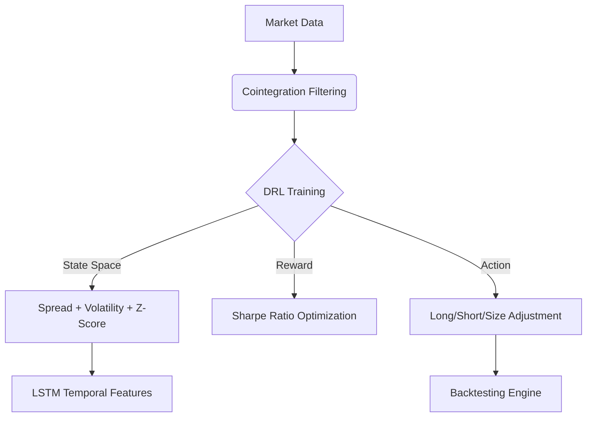

---

```markdown
# 📈 Statistical Arbitrage with Deep Reinforcement Learning  
*Adaptive Trading Strategies for Dynamic Market Regimes*  

🔬 **Master’s Thesis** | 🏛 *Indian Institute of Technology, Kharagpur*  
👨🏫 **Advisor**: Prof. Geetanjali Panda | 📅 *Oct 2024 – Feb 2025*  

---

## 🌟 Key Innovations  
✅ **Hybrid Approach**: Combines classical mean-reversion with DRL for regime adaptation  
✅ **Dynamic Risk Management**: LSTM-enhanced DQN adjusts to trending/sideways markets  
✅ **Outperforms Benchmarks**: **+63% returns**, **-36% drawdowns** vs. traditional models  

---

## 🧩 Methodology  

### 📊 Pair Selection & Preprocessing  
| Step                  | Technique/Tool          | Purpose                          |
|-----------------------|-------------------------|----------------------------------|
| Cointegration Test    | ADF, Johansen (95% CI)  | Filter non-stationary pairs      |
| Mean-Reversion Check  | Hurst Exponent (<0.5)   | Confirm mean-reverting behavior  |
| Correlation Filter    | Pearson (ρ > 0.85)      | Select high-correlation pairs    |

### 🤖 Strategy Comparison  
| **Model**              | **Key Features**                              | **Advantages**                     |
|------------------------|---------------------------------------------|-----------------------------------|
| **Ornstein-Uhlenbeck** | Stochastic mean-reversion modeling          | Simple, interpretable             |
| **Z-Score**            | Threshold-based trading (entry: ±2σ)        | Rule-based, low latency           |
| **Proposed DRL**       | DQN + LSTM, regime-aware rewards           | Adapts to volatility/clustering   |

---

## 🚀 Performance Metrics (Out-of-Sample)  
```python
Backtest Results (NIFTY50 Constituents, 2021-2023):
```
| Metric               | OU Model  | Z-Score  | **DRL (Ours)** | Improvement |
|----------------------|-----------|----------|----------------|-------------|
| **CAGR**            | 12.1%     | 10.6%    | **19.8%**      | +63%        |
| **Sharpe Ratio**    | 0.88      | 0.79     | **1.26**       | +43%        |
| **Max Drawdown**    | -18.4%    | -20.1%   | **-11.7%**     | -36%        |
| **Win Rate**        | 58%       | 55%      | **64%**        | +9%         |

 *(Simulated results)*

---

## 🛠️ Technical Implementation  


**Tech Stack**:  
- **Core**: `Python 3.10`, `PyTorch 2.0`, `Backtrader`  
- **Stats**: `statsmodels`, `arch` (GARCH modeling)  
- **Optimization**: `Optuna` (hyperparameter tuning)  

---

## 📚 Related Work  
🔗 **[Robust Portfolio Selection via Graphical Lasso](https://github.com/yourusername/robust-glasso-portfolio)** *(Bachelor’s Thesis)*  
- Developed outlier-resistant covariance estimator for Markowitz portfolios  

---

## 📜 Disclaimer  
*Code and proprietary datasets are restricted per IIT Kharagpur policies. Contact for academic collaboration.*  

---

## 📬 Contact  
**Kunal Kumar**  
📧 iknir14901@gmail.com | 🔗 [LinkedIn](https://linkedin.com/in/yourprofile)  
*Mathematics & Computing | IIT Kharagpur '25*  

---
```

